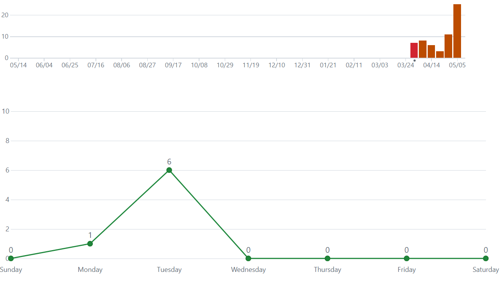

# - 게임에 대한 간단한 소개
    쓰리매치, 니편내편, 슬라이스 등의 세가지 미니 게임
    미니게임을 통해 흭득한 재료로 가게를 운영하는 방치형 게임  ⠀
 

# - 현재까지의 진행 상황 (개발 일정 기반) 
**1주차(2024.04.04.목 ~ 2024.04.10.수)**  ->    100% 
- [x] 리소스 수집 및 개발 관련 데이터 수집~~

**2주차(2024.04.11.목 ~ 2024.04.17.수)**  ->     100% 
- [x] 마을 맵(메인 맵) 개발 진행
- [x] 맵 내 장소들을 선택 시 비어있는 레벨(액티비티)이 실행되도록 구현~~

**3주차(2024.04.18.목 ~ 2024.04.24.수)**  ->     100% 
- [x] 농장 미니게임(쓰리매치) 구현~~
- [x] 1차 재료에 대한 메인 변수 관리~~
- [x] 목장 미니게임(니편내편) 구현~~

**4주차(2024.04.25.목 ~ 2024.05.01.수)**  ->     100% 
- [x] 이미지 자르기 로직 탐색 및 구현~~
- [x] 재료 준비소 미니게임(후르츠닌자) 구현~~
- [x] 2차 재료 및 재화(골드)에 대한 메인 변수 관리~~

**5주차(2024.05.02.목 ~ 2024.05.08.수)**  ->     100% 
- [x] 3~4주차 미니게임 제작 미달성 계획 구현~~

**6주차(2024.05.09.목 ~ 2024.05.15.수)**
- [ ] 가게 내 테이블 배치 및 증축 기능 구현

**7주차(2024.05.16.목 ~ 2024.05.22.수)**
- [ ] 요리사, 서빙 알바생의 AI 구현 및 배치

**8주차(2024.05.23.목 ~ 2024.05.29.수)**
- [ ] 6~7주차 가게 제작 미달성 계획 구현
- [ ] 오프라인 방치 재화 수급 시스템 구현

**9주차(2024.05.30.목 ~ 2024.06.05.수)**
- [ ] 버그 수정 및 릴리즈 제작

 

# - git commit 데이터
**총 60 커밋**
|**주간**|커밋 횟수|주간|커밋 횟수|
|---|---|---|---|
|1주차||2주차||
|3주차||4주차||
|5주차||6주차||!

 

# 변경된 목표에 대한 내용
현재(6주차) 까지 변경된 목표는 없으며, 
기존 계획대로 구현 진행중

 

# 게임에 대한 정보

    
 모든 Scene에 대한 정보 

    
       
    1. LogoScene
      - 시작이 되는 씬
      - 한국공학대학교" 타이틀 띄우기
      - 일정 시간이 지나면 "TitleScene" 으로 이동
    
    2. TitleScene
      - 게임의 제목이 나오는 씬
      - 화면 클릭 시 "TownScene"으로 이동

    3. TownScene
      - 게임의 메인 화면이 되는 마을 씬
      - 마을 내 밭, 목장, 재료가공소, 식당을 누르면 해당하는 씬으로 이동
      - 해당 영역을 누르면 씬 변경
        - 밭 영역 누를 시 "FieldGameInfoScene" 으로 이동
        - 목장 영역 누를 시 "FarmGameInfoScene" 으로 이동
        - 재료가공소 영역 누를 시 "FoodPrepInfoScene" 으로 이동
        - 식당에 대한 영역 구현은 미구현
    
    4. XXXGameInfoScene
      - 특정 미니게임 설명 씬
      - 화면 클릭 시 해당 미니게임으로 연결
 
    5. XXXGameScene
      - 미니게임을 플레이 하는 씬
      - 게임 플레이에 따라 해당 게임 Score를 흭득

      5-1. FieldGameScene
          - 쓰리매치 미니게임 씬
          - 블럭 클릭 후 이동할 인접 블럭 클릭을 통해 게임 진행
          - 1차 재료 (비트, 당근, 양상추, 양파, 감자) 흭득 가능
          
      5-2. FarmGameScene
          - 청기백기와 유사한 형태의 게임
          - 선두의 동물과 동일한 버튼을 클릭하여 점수를 흭득
          - 1차 재료 (소, 돼지, 닭) 흭득 가능
      
      5-3. FoodPrepGameScene
          - 미니게임에서 흭득한 1차 재료를 이용하여 진행하는 이미지 슬라이스 게임
          - 손질된 2차 재료 (비트, 당근, 양상추, 양파, 감자, 소고기, 돼지고기, 닭고기) 흭득 가능
      
      - 게임 종료(TimerSystem 종료 트리거 실행)시 "MiniGameResultScene" 으로 이동
    
    6. MiniGameResultScene
      - 미니게임의 결과(흭득한 재료)를 나타내는 씬
      - 이전 게임의 결과를 HashMap의 구조로 전달받아 MyData내 정보에 저장 및 파일 데이터 쓰기
      - 화면 클릭 시 "TownScene"으로 이동

 

Scene 내 Class 구성 정보 및 상호작용
        

 

Scene별 핵심 클래스 및 코드에 대한 설명
| 클래스 관계도 | 설명 |
|---|---|
||BaseScene내 게임 시스템을 시작 및 종료하는 StartGame()/FinishGame() 함수  CountDownClass로 게임 시작시 n초의 카운트 다운 후 StartGame() 실행  시간을 관리하는 TimerSystem 내에서 남은 시간에 대한 UI 드로우 및 씬의 게임을 종료시키는 기능|
||FieldGameScene 내에 게임의 보드판에 대한 FieldBoard 인스턴스를 보유  FieldBoard는 가로와 세로 길이에 맞게 FoodBlock[][] 배열 보유  FieldGameScene내에서 FieldBoard Layer에 Click될 경우 onClickEvent() 실행 ClickEvent에 따라 FoodBlock을 Pick하거나 Swap|
||FarmGameScene 내 동물의 종류를 나타내는 EFarmAnimalType[] 변수 존재  AnimalButton을 통해 선두의 동물 타입을 확인하여 FeedAnimal() 실행 선두의 동물 타입과 맞는 버튼을 누를 시 점수 추가|
||각 미니게임 씬들마다 FinishGame시 게임의 결과를 ResultDataMap에 담아 MiniGameResultScene으로 전달  MyData 클래스의 Data에 AddResultData()를 통해 갱신시키고 SaveData()를 실행해 파일에 기록|
