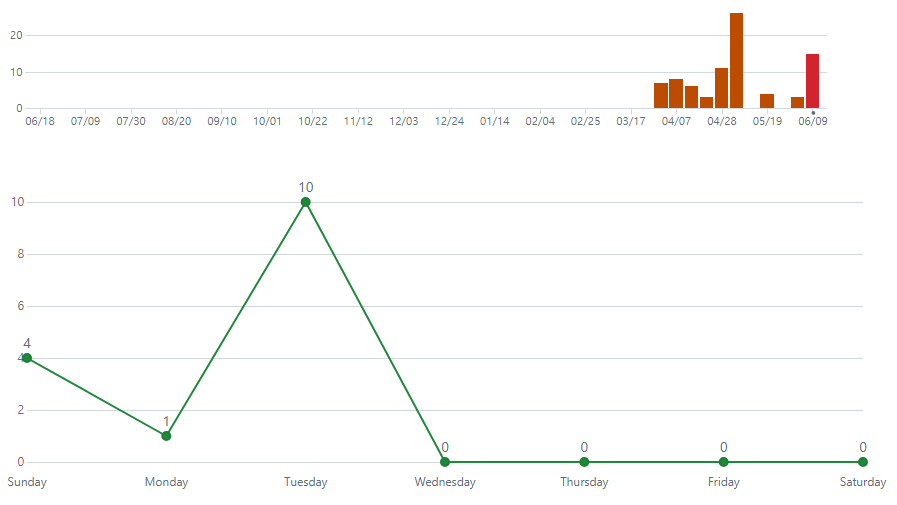

# - 게임에 대한 간단한 소개
    쓰리매치, 니편내편, 슬라이스 등의 세가지 미니 게임
    미니게임을 통해 흭득한 재료로 가게를 운영하는 방치형 게임  ⠀
 

# - 개발 계획 대비 일정 기준 모두 구현 완료
**1주차(2024.04.04.목 ~ 2024.04.10.수)**  ->    100% 
- [x] 리소스 수집 및 개발 관련 데이터 수집

**2주차(2024.04.11.목 ~ 2024.04.17.수)**  ->     100% 
- [x] 마을 맵(메인 맵) 개발 진행
- [x] 맵 내 장소들을 선택 시 비어있는 레벨(액티비티)이 실행되도록 구현

**3주차(2024.04.18.목 ~ 2024.04.24.수)**  ->     100% 
- [x] 농장 미니게임(쓰리매치) 구현
- [x] 1차 재료에 대한 메인 변수 관리
- [x] 목장 미니게임(니편내편) 구현

**4주차(2024.04.25.목 ~ 2024.05.01.수)**  ->     100% 
- [x] 이미지 자르기 로직 탐색 및 구현
- [x] 재료 준비소 미니게임(후르츠닌자) 구현
- [x] 2차 재료 및 재화(골드)에 대한 메인 변수 관리

**5주차(2024.05.02.목 ~ 2024.05.08.수)**  ->     100% 
- [x] 3~4주차 미니게임 제작 미달성 계획 구현~~

**6주차(2024.05.09.목 ~ 2024.05.15.수)**  ->     100% 
- [x] 가게 내 테이블 배치 ~~증축 기능 구현~~

**7주차(2024.05.16.목 ~ 2024.05.22.수)**  ->     100% 
- [x] 요리사, 서빙 알바생의 AI 구현 및 배치
- [x] 요리사, 서빙 알바생 증축 기능 구현 (추가)

**8주차(2024.05.23.목 ~ 2024.05.29.수)**  ->     100% 
- [x] 6~7주차 가게 제작 미달성 계획 구현
- [x] 오프라인 방치 재화 수급 시스템 구현

**9주차(2024.05.30.목 ~ 2024.06.05.수)**  ->     100% 
- [x] 버그 수정 및 릴리즈 제작

 

# - git commit 데이터
**총 82 커밋**
 (주차별 커밋 횟수는 README_2.md 내에 존재)
|**주간**|커밋 횟수|
|---|---|
|1~9주차||!

 

# 게임에 대한 정보
## 직접 개발한 것(사용된 기술)
- 게임 프레임 워크 내 Scene을 통하여 
FieldGameScene, FarmGameScene, FoodPrepHouseGame 등의 미니게임 씬 및 
RestaurantScene 등의 게임 씬 제작 

- 미니게임 내의 로직 등 
밭 미니게임의 쓰리매치 블럭 파괴 로직  

- 레스토랑 내 캐릭터들의 FSM 기반 AI
요리사, 서빙, 손님 등의 AI State 기획 및 구현   

## 참고한 것들
수업 중 진행한 게임 프레임워크 코드  
내부 저장소 storage 내 데이터 파일 저장 및 읽기 방법 

## 수업내용에서 차용한 것
IGameObject 
Sprite, AnimSprite 
Scene 
등의 전반적인 게임 프레임 워크 

# 아쉬운 점
## 하고 싶었지만 못 한 것들
- 다양한 리소스를 활용해서 게임다운 게임을 만들고 싶었지만 시간이 부족
- 다양한 사운드 리소스를 넣지 못함
- AI가 한 맵에 대하여 하드코딩 된 부분이 존재

## 팔기 위해 보충할 것들
- 리소스 수정 및 사운드 리소스 추가
- 레스토랑 레벨의 다양한 컨텐츠 추가 (건물 확장 및 많은 레벨)

# 수업에 대한 내용
## 기대한 것
- 안드로이드 기반 스마트폰 게임을 만들 수 있는 능력
- Java 언어 배우기

## 얻은 것
- Android Studio 사용 능력
- Java 언어 사용 능력
- 다양한 디자인 패턴 학습
- Java 기반 게임 프레임 워크

## 더 좋은 수업이 되기 위해 변화할 점
- 수업 내에 같이 코드를 작성하며 진행할 때가 더 쉽게 이해 하였습니다.
Git 기반 진행 외 같이 코드를 작성하며 진행도 하면 좋겠습니다.

